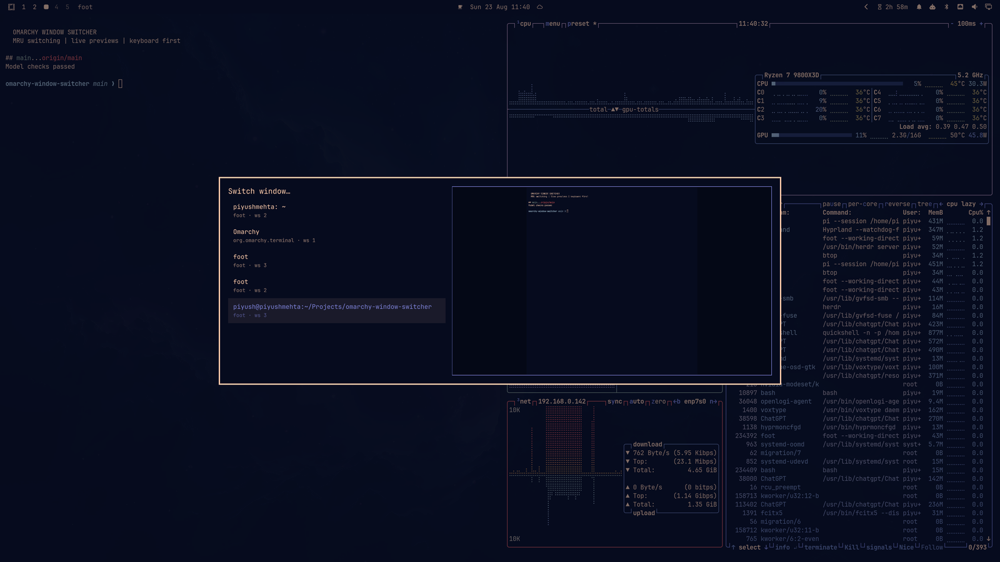
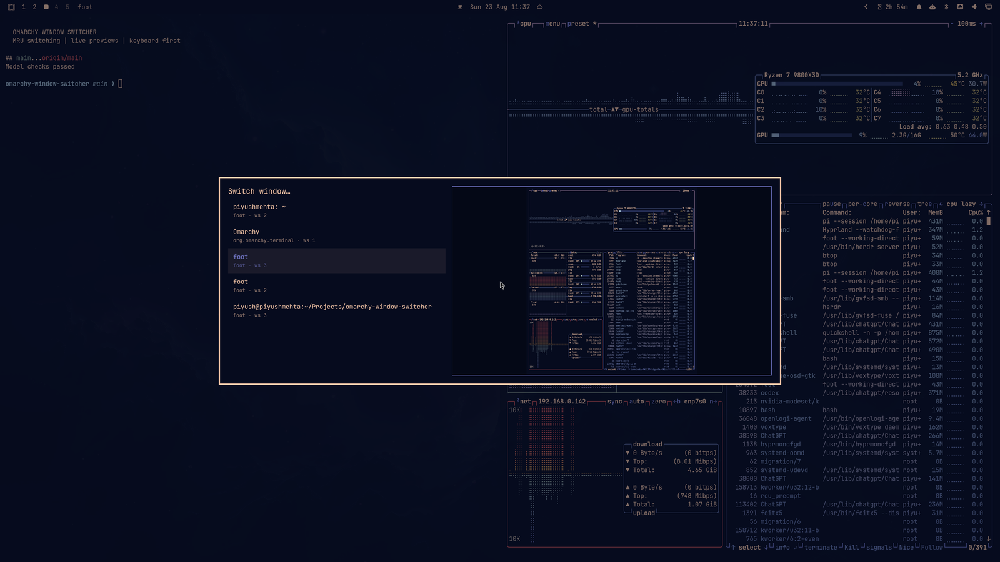

# Omarchy Window Switcher

A Windows-style `Alt+Tab` switcher for Omarchy with MRU ordering, repeated-key cycling, type-to-filter search, and one live preview of the selected window.


## Features

- Recent-window-first ordering from Hyprland focus history
- Repeated `Alt+Tab` cycles without closing or resetting the overlay
- Search by window title, application, or workspace
- One live screencopy stream for the highlighted window
- List-only fallback when a window cannot be captured
- Native Wayland activation with a `hyprctl` fallback
- Keyboard-first controls with mouse selection and click-outside dismissal
- No extra packages, services, permissions, or configuration files required

## Requirements

- Omarchy with the Quickshell shell
- Hyprland
- `hyprland-toplevel-export-v1` for live previews

Window switching and search still work without toplevel export; only the preview pane is unavailable.

## Install

```bash
omarchy plugin add https://github.com/piyush97/omarchy-window-switcher.git --enable --yes
```

Confirm that Omarchy discovered and enabled it:

```bash
omarchy plugin list --json \
  | jq '.[] | select(.id == "piyush.window-switcher")'
```

For a private fork, Git must already be authenticated to GitHub. No `sudo` or additional package installation is needed.

## Set up Alt+Tab

Omarchy normally binds these keys to direct window cycling. Replace those bindings in `~/.config/hypr/bindings.lua`:

```lua
hl.unbind("ALT + TAB")
hl.unbind("ALT + SHIFT + TAB")

o.bind("ALT + TAB", "Window switcher", "omarchy-shell shell summon piyush.window-switcher '{\"mode\":\"cycle\",\"direction\":1}'")
o.bind("ALT + SHIFT + TAB", "Window switcher (reverse)", "omarchy-shell shell summon piyush.window-switcher '{\"mode\":\"cycle\",\"direction\":-1}'")
```

Reload and validate Hyprland:

```bash
hyprctl reload
hyprctl configerrors
```

`configerrors` should return no errors. If you prefer not to replace the defaults, run the summon command directly or bind it to another key.

## Use it

### Alt+Tab mode

1. Hold `Alt` and press `Tab` to open the switcher.
2. Press `Tab` repeatedly to move forward, or `Alt+Shift+Tab` to move backward.
3. Release `Alt` to activate the highlighted window. `Enter` always activates it.
4. Press `Esc` or click outside to cancel.

If the compositor does not forward the modifier-release event, use `Enter` or click the selected row.

### Search mode

Open the picker without a cycle payload:

```bash
omarchy-shell shell toggle piyush.window-switcher
```

Then type to filter by title, application, or workspace.

| Key | Action |
| --- | --- |
| `Tab`, `Down`, `Right` | Next window |
| `Shift+Tab`, `Up`, `Left` | Previous window |
| Type | Filter windows |
| `Backspace` | Delete one character |
| `Ctrl+Backspace` | Delete one word |
| `Ctrl+U` | Clear the search |
| `Enter` or click | Focus the selected window |
| `Esc` or click outside | Close without switching |

## Screenshots

The preview updates as the highlighted window changes:





`preview.png` is also the marketplace preview image used by Omarchy plugin directories.

## Update, disable, and remove

Update an installed copy:

```bash
omarchy plugin update piyush.window-switcher --yes
```

Disable it temporarily:

```bash
omarchy plugin disable piyush.window-switcher
```

Enable it again:

```bash
omarchy plugin enable piyush.window-switcher
```

Remove it:

```bash
omarchy plugin remove piyush.window-switcher --yes
```

## Troubleshooting

### The plugin is not listed

Rescan the shell, then check the plugin list again:

```bash
omarchy-shell shell rescanPlugins
omarchy plugin list --json
```

### The overlay opens but has no preview

This is expected when the selected window does not expose a capturable Wayland toplevel, or when `hyprland-toplevel-export-v1` is unavailable. Switching and search continue to work in list-only mode.

### Alt+Tab still directly switches windows

Check that the two original bindings were unbound, then reload Hyprland and verify:

```bash
omarchy menu keybindings --print | grep -E 'ALT \\+ TAB|SHIFT ALT \\+ TAB|Window switcher'
hyprctl configerrors
```

### The plugin loads with errors

Inspect the shell log:

```bash
journalctl --user -f | grep -Ei 'piyush.window-switcher|Switcher.qml|qml.*(error|warning)'
```

## Development

Run the lightweight checks from the repository root:

```bash
node test_model.js
omarchy plugin validate .
git diff --check
```

During local development, copy or clone the repository under `~/.config/omarchy/plugins/piyush.window-switcher/`. The Omarchy shell hot-reloads plugin changes; force discovery with:

```bash
omarchy-shell shell rescanPlugins
```

## Design notes

The plugin intentionally creates only one live preview stream for the selected window. It does not create thumbnails for every row or store persistent window history, keeping Alt+Tab responsive and GPU usage predictable.
